# Tutorial: Aiven Kafka Quickstart using Python
## A Yahoo! Finance Stock Symbols Info Kafka producer to Aiven Kafka Service

This repo provides a simple guide to a Aiven Kafka producer app that produces messages to Aiven Kafka Service.  The idea is to help you accelerate appplication development on Aiven Cloud Service using Kafka.

## What is built

You will build a simple kafka producer application sending sample stock symbol messages to a kafka topic on a Aiven Kafka Service. 

The alphabet for Modern English consisting of 26 letters. The Dow Jones Industrial Average consists of companies, each one being assigned with a unique ticker or stock symbol. Only a few have stock symbols composed of only one letter.

From the 26 letters mentioned, only 23 are used by companies (3 had been delisted). The current application randomly selects 12 of those companies, and using the Yahoo! Finance service obtains basic information about the company. Then, the Kafka service you create into Aiven uses Python code to produce valid JSON data to a topic in that service.

The key is a valid JSON string containing a random id, e.g. UUID, and the message payload is a valid JSON object. The events include a timestamp represented by a string with the date in ISO 8601 format.

The producer's data is then readable from the Aiven web console from the Kafka service view (> Topics => Topic => Fetch Messages (Format: json))

## What you need

- About 30 mins
- Code
  - Python with Kafka libraries
- Aiven Cloud free account

## How to complete this tutorial

### Setup Aiven Cloud Kafka Service

1. Register a free Aiven account

   Go to https://aiven.io and register a free account. You will have 300usd credits which is enough to deploy data services we need in this tutorial. Once you registered, you can login to Aiven dashboard. The dashboard looks like this. 
   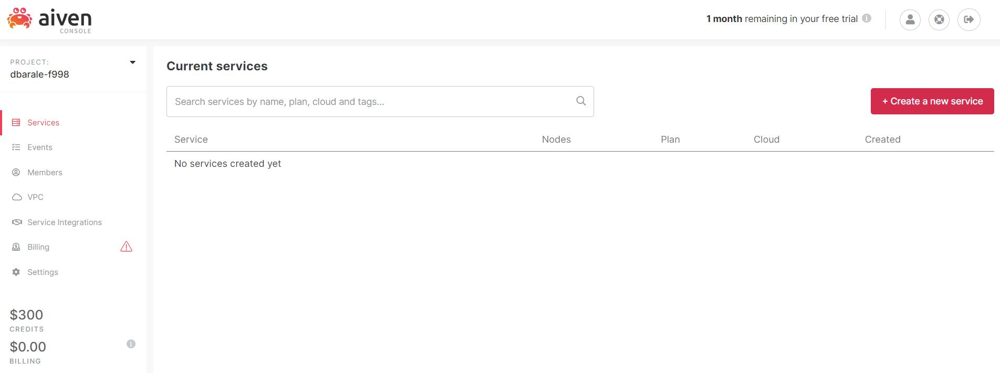

2. Create a Kafka service

   Click on **+Create a new service** and you should see a list of services available. 
   1. Choose Apache Kafka
      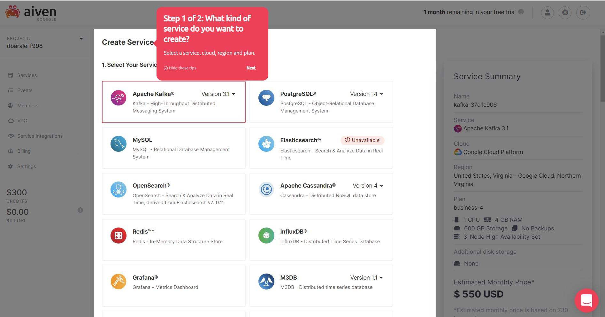

   2. Select Service Cloud Provider (Google Cloud)
      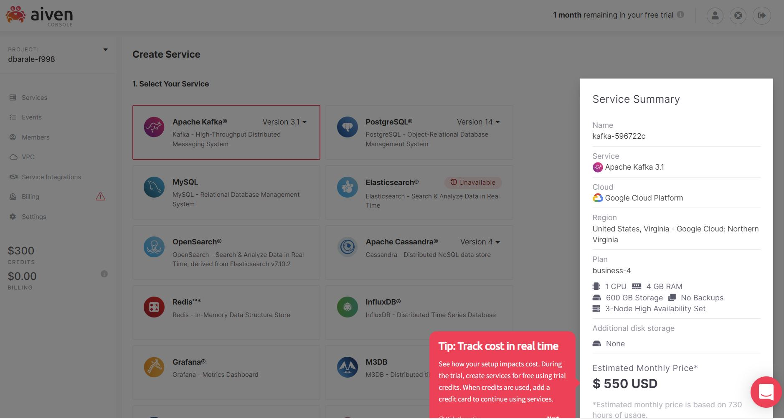

   3. Select Service Cloud Region (google-us-virginia)
      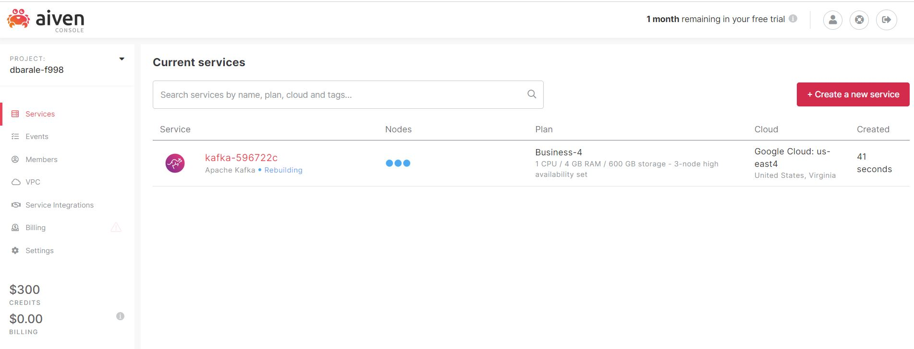

   4. Select Service Plan (for this tutorial, Business-4 is good enough)
      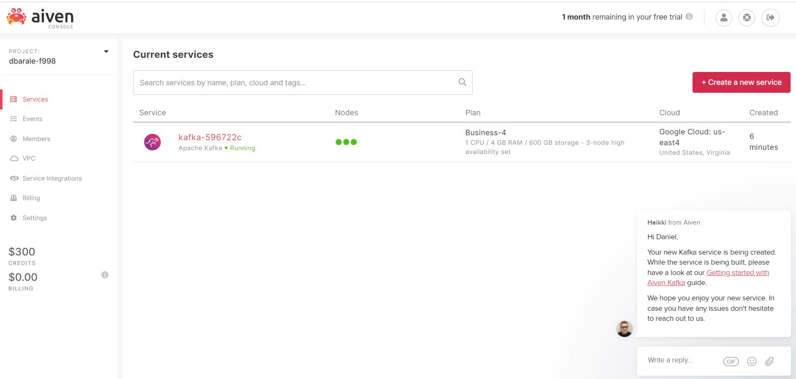

3. Create a InfluxDB and Grafana services

   From the dashboard, you can enable metrics and log integration with kafka service.

   1. Aiven WebUI has a good UX design, so you can create InfluxDB service and Grafana service with similar steps.

   2. Once you have InfluxDB and Grafana services, click on the **Enable Metrics Integration**, **Enable Log Integration**,  **Enable Dashboard integration** and then pick the InfluxDB and Grafana service instance respectively.

4. Grafana Dashboard
   Go to Grafana service page, you can use the username and credential to login Grafana WebUI and check the Kafka metrics.

5. Kafka service access credential (cert authentication)

   For now, we are ready to switch to "dev" role and write some codes. First thing a developer needs is "access credential". You can find the info in the overview page.

### Aiven Kafka Quickstart using Python

We will use PyCharm IDE for Python and create the necessary code:

 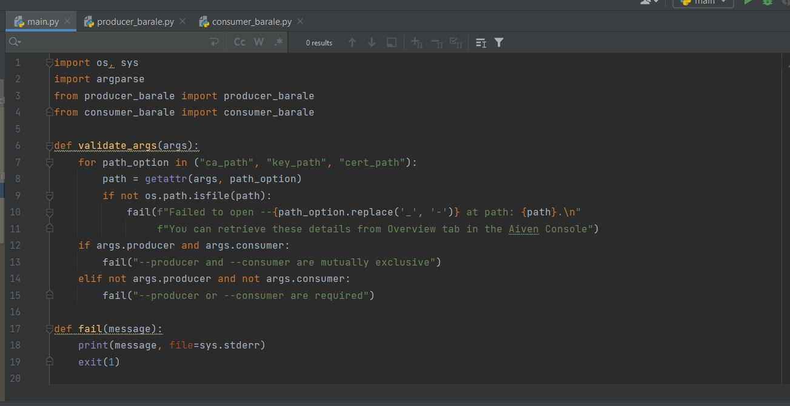
 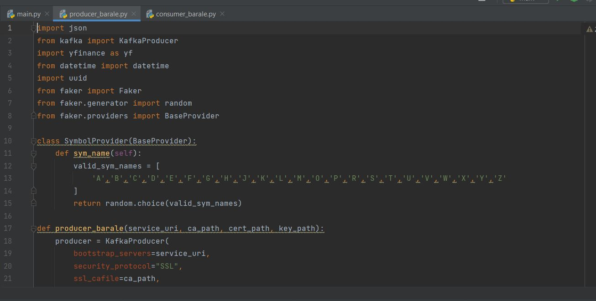
 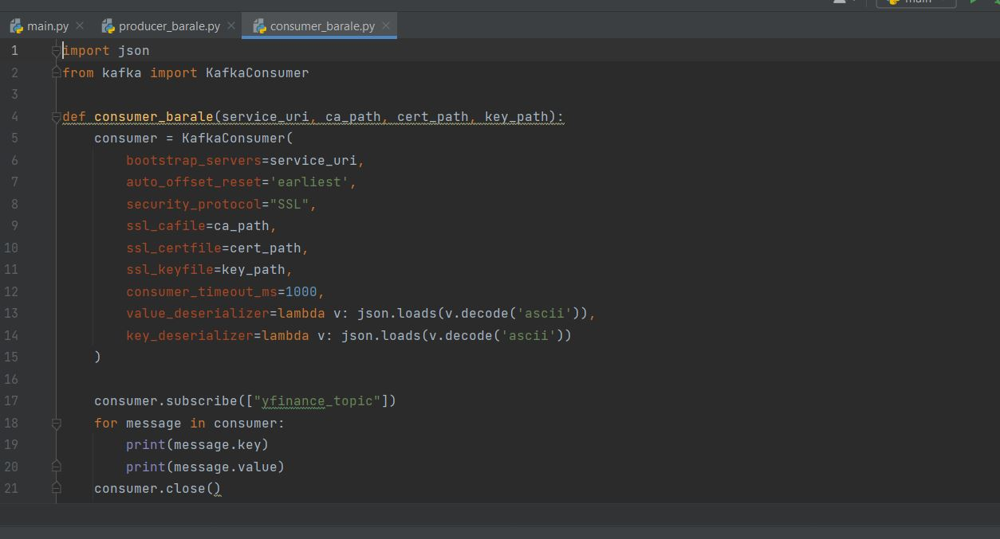

1. Create those 3 .py files. The main.py script is the main driver of the app. The producer.py and consumer.py are as the name implies, the Kafka message producer and consumer respectively.

The main driver has a toggle functionality. When defining the run configuration parameters, the last parameter is "producer" to invoke the producer, or "consumer" to call the consumer script respectively.

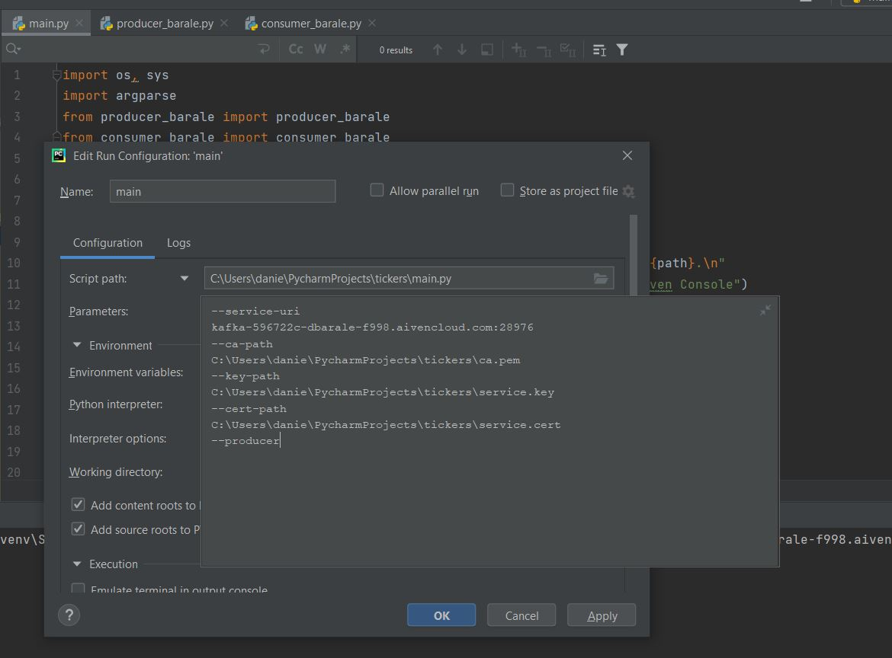

2. Running the producer script will generate 12 messages using randomly picked single letter stock symbol (such as C for Citibank, Z for Zillow, for instance). The random algorithm is based on the "faker" class used by Aiven to generate random data.

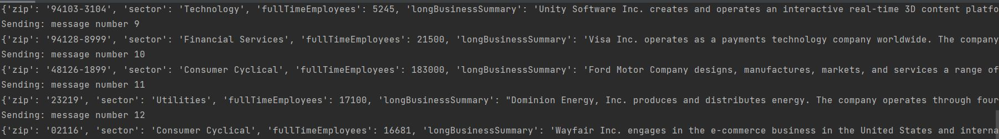

3. The producer's data should be readable from the Aiven web console from the Kafka service view > Topics => Topic => Fetch Messages (Format: json)

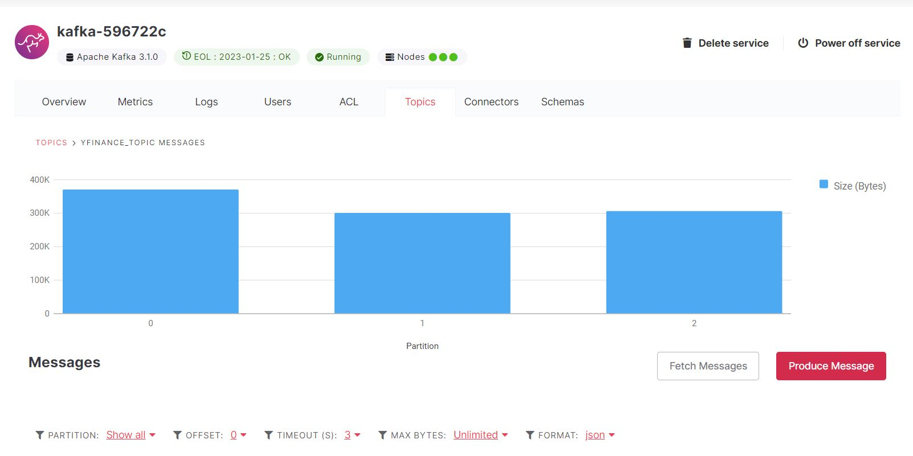
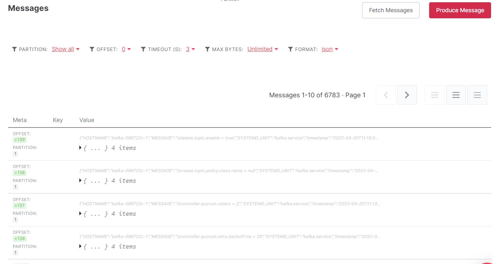

4. The key of the messages is a random UUID embedded in a JSON element.

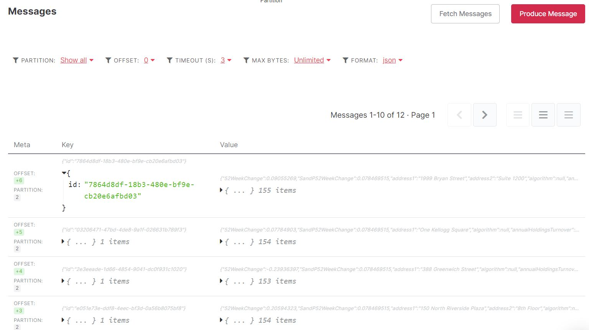

5. The value of the messages is the company info as Yahoo! Finance embedded in a JSON element.

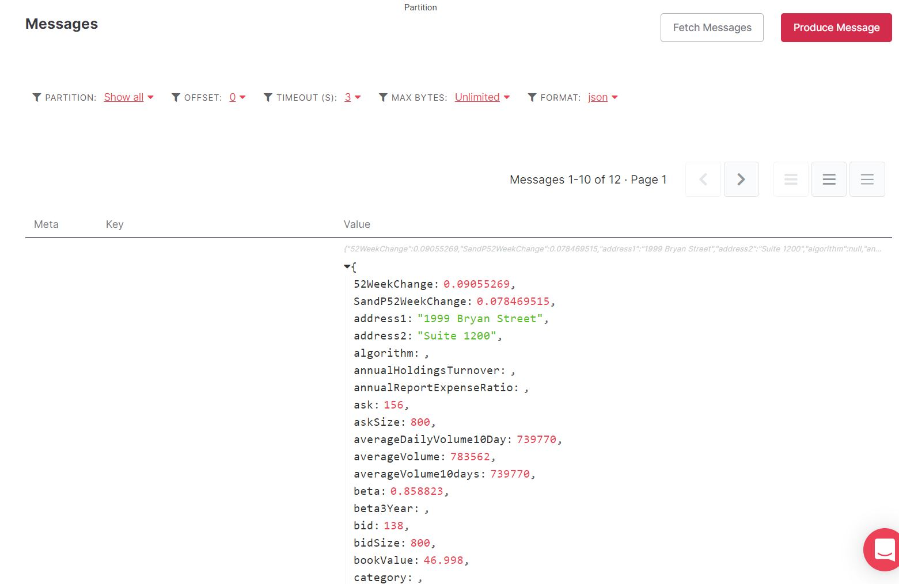

6. Within embedded value JSON element there is a "ts" entry with the message creation date in ISO 8601 format.

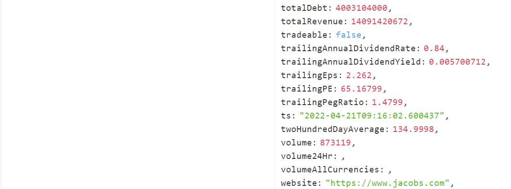
